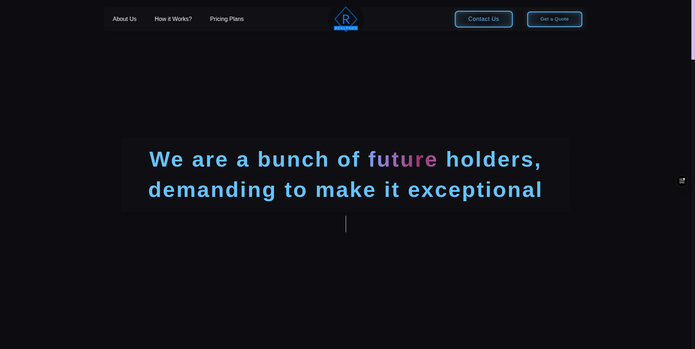
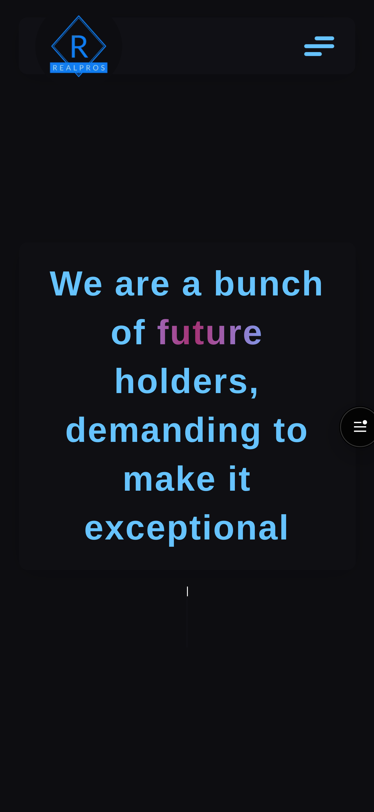

# RealPros - Call Center Company

A website highlighting the features and pricing plans of the call center company RealPros. Multiple forms are included on the website to assist the owner in tracking where users submitted their quotes, giving them information about how far prospective customers were able to explore the site. This feature improves lead tracking and makes it possible to comprehend user behavior better.

## Table of contents

- [Overview](#overview)
  - [Screenshot](#screenshot)
  - [Links](#links)
- [My process](#my-process)
  - [The idea](#the-idea)
  - [Built with](#built-with)
- [Author](#author)

## Overview

### Screenshot

### Links

- Live Site URL: [Live site URL here](https://callcenter-company.mohamedwaled.com/)

## My process

### The idea

This website was a bit challenging for me. The owner asked for a website that shows clients the features he provides and his prices, and, most importantly, he wanted to know how far potential clients had gone on the website, so he could track what they had seen. We started by defining "potential clients" as those who reach out to the company for information or quotations. The next question was: would you need a contact form? When the answer was yes, we found a simple and effective solution. We decided to add three different forms to the site: one at the very bottom of the features page, one at the very bottom of the pricing page, and one in a pop-up that appears when entering the site. So, if a potential client used the form on the pricing page, it meant they had seen the prices, and the owner could benefit from this information by making his call with them a bit smoother. And just like that, we fulfilled the owner's wishes!

> [!WARNING]
> Be aware of touching the planets on the [Pricing Plans](https://callcenter-company.mohamedwaled.com/pricing-plans) page!

### Built with

- HTML5
- React.js
- Next.js
- Page Router
- Framer Motion
- SCSS
- npx create-next-app
- npm
- API

## Author

- Linkedin - [@mohamed-waled](https://www.linkedin.com/in/mohamed-waled)
